# Software Architecture

## Table of Contents

1. [Overview](#1-overview)
2. [Repository Layout](#2-repository-layout)
3. [Extension Lifecycle](#3-extension-lifecycle)
4. [Component Map](#4-component-map)
5. [Webview Message Protocols](#5-webview-message-protocols)
6. [Skill Validation Engine](#6-skill-validation-engine)
7. [MCP Integration](#7-mcp-integration)
8. [Data Models](#8-data-models)
9. [Build & Release Pipeline](#9-build--release-pipeline)
10. [Security Model](#10-security-model)
11. [Skills in This Repository](#11-skills-in-this-repository)

---

## 1. Overview

**Salesforce Github Copilot** is a VS Code extension that audits and configures GitHub Copilot and Salesforce AI tooling in a workspace. It exposes a sidebar with four tabs and two full editor panels.

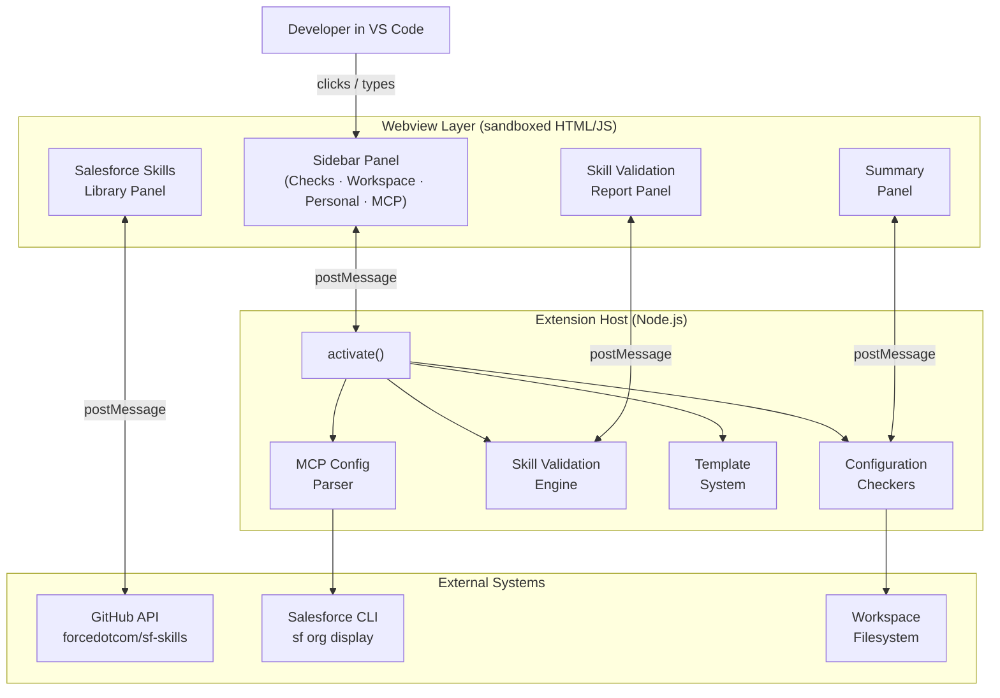

**Key design decisions:**

- **Zero production npm dependencies** — all logic is pure TypeScript over Node.js built-ins (`fs`, `path`, `https`, `os`, `child_process`).
- **Single-file architecture** — the entire extension lives in `src/extension.ts` (~3 900 lines), keeping the bundle small and the build fast.
- **Webviews are sandboxed** — each panel communicates exclusively through a typed `postMessage` protocol; no shared memory with the extension host.

---

## 2. Repository Layout

```
salesforce-copilot-inspector/
├── src/
│   ├── extension.ts              # Entire extension source (~3 900 lines)
│   └── test/
│       └── extension.test.ts     # 40+ unit tests for validators
├── dist/                         # esbuild output (git-ignored)
│   └── extension.js              # Bundled, production-minified
├── out/                          # tsc output used by test runner
├── assets/
│   └── logo.png
├── media/
│   └── icon.svg
├── .github/
│   ├── workflows/
│   │   ├── audit.yml             # Weekly npm audit (high + critical)
│   │   └── release.yml           # VSIX release on v* tag
│   └── skills/                   # Repository skills (see §11)
├── .vscode/
│   ├── launch.json               # F5 Extension Development Host
│   ├── tasks.json
│   ├── settings.json
│   ├── extensions.json
│   └── mcp.json                  # Salesforce MCP for this workspace
├── esbuild.js                    # Build script
├── .vscode-test.mjs              # Test runner config
├── tsconfig.json
├── package.json
├── DEVELOPER.md
├── SOFTWARE_ARCHITECTURE.md      # this file
└── README.md
```

---

## 3. Extension Lifecycle

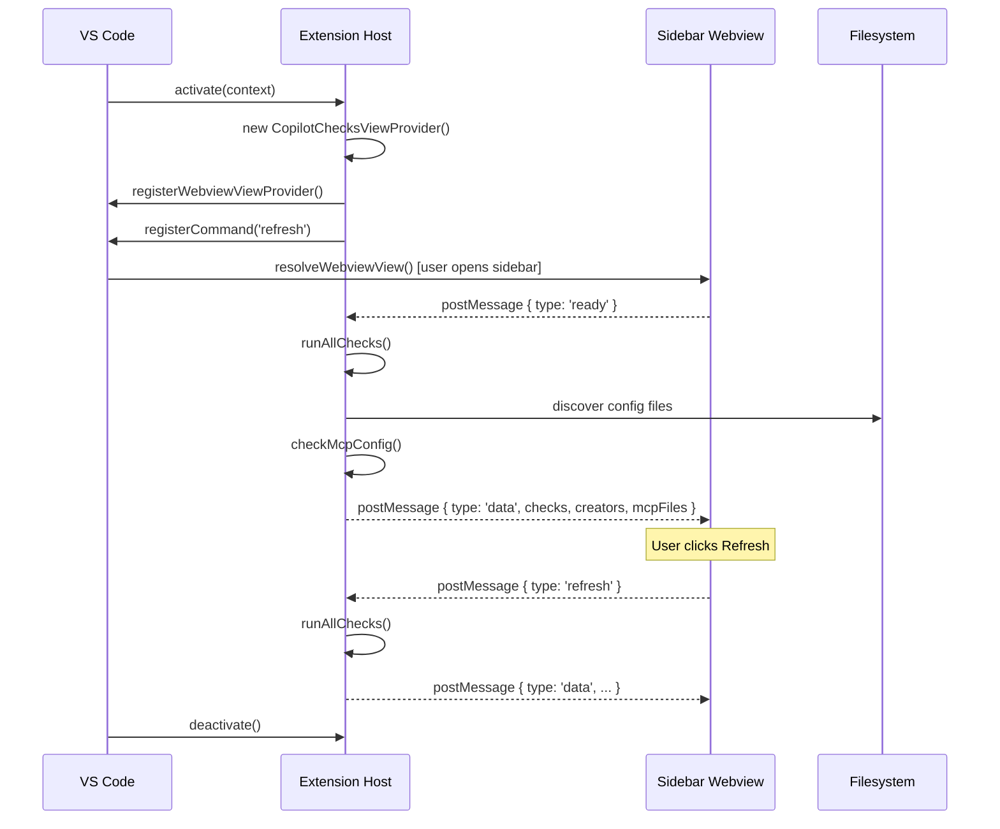

---

## 4. Component Map

The extension exposes **four independent UI components**. Each is a separate class that manages its own webview lifecycle.

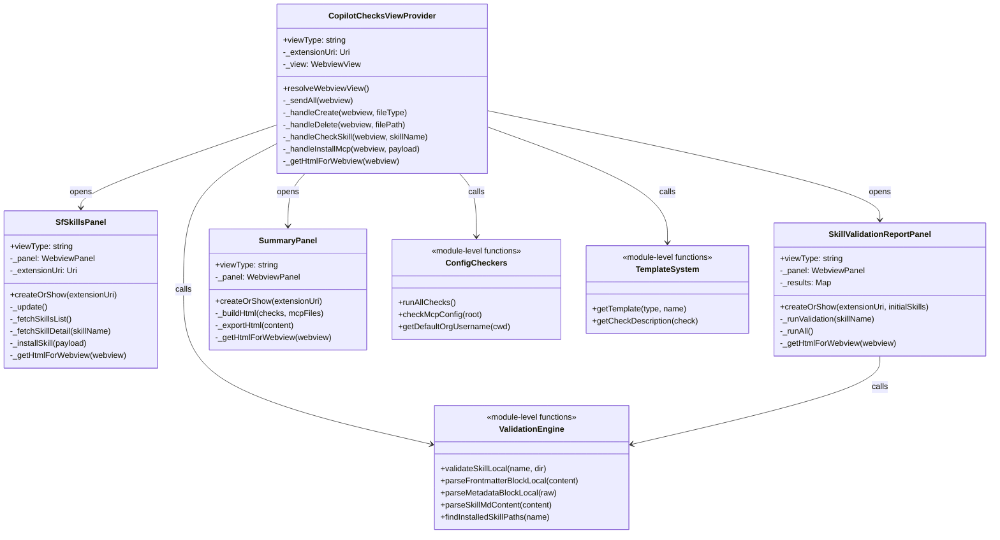

### Responsibility split

| Component | Scope | Renders in |
|---|---|---|
| `CopilotChecksViewProvider` | Sidebar — 4-tab audit dashboard | Activity Bar panel |
| `SfSkillsPanel` | Browse & install `forcedotcom/sf-skills` | Full editor panel |
| `SkillValidationReportPanel` | Validate installed skills against agentskills.io spec | Full editor panel |
| `SummaryPanel` | Exportable HTML summary of all checks | Full editor panel |

---

## 5. Webview Message Protocols

Every component communicates with its webview through a **typed, one-way-at-a-time** message bus. The extension host is always authoritative.

### 5.1 Sidebar (`CopilotChecksViewProvider`)

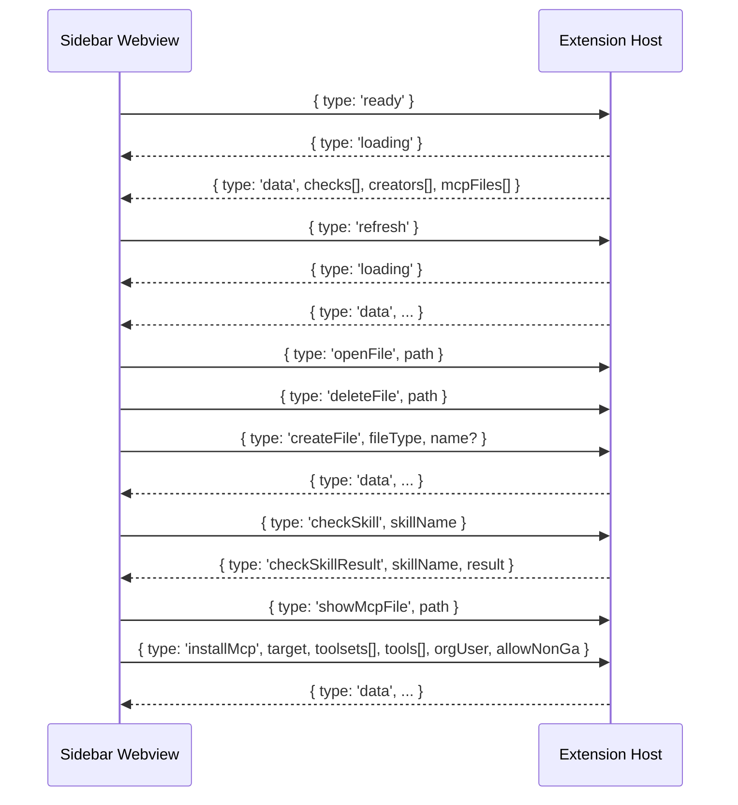

### 5.2 Skills Library (`SfSkillsPanel`)

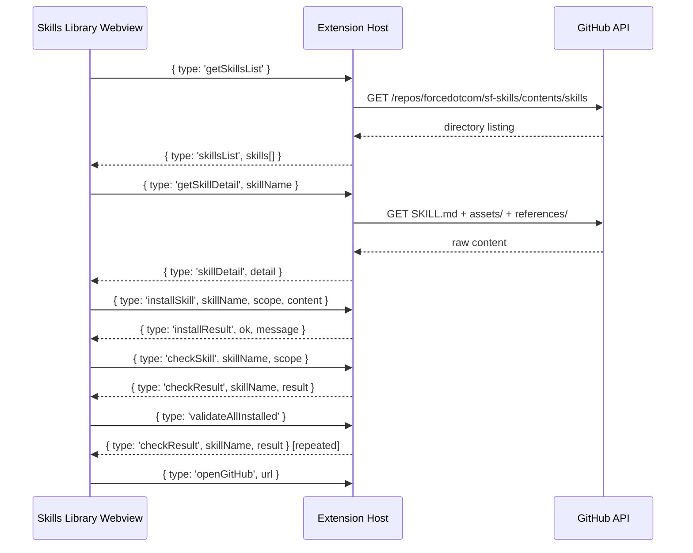

### 5.3 Validation Report (`SkillValidationReportPanel`)

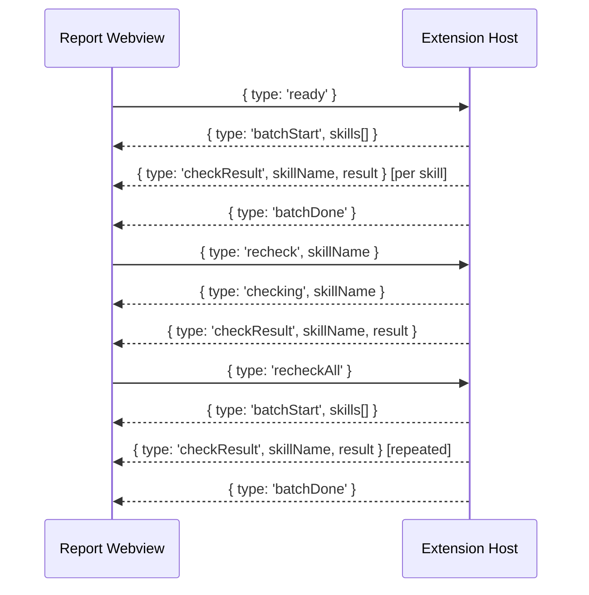

---

## 6. Skill Validation Engine

The validation engine is a set of **pure, export-tested functions** with no VS Code API dependency — making them fast to unit-test.

### 6.1 Parsing pipeline

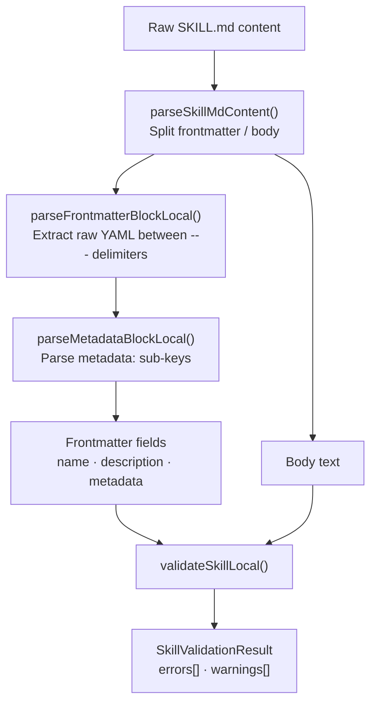

### 6.2 Validation rules

| Rule | Level | Detail |
|---|---|---|
| Directory name is kebab-case | error | lowercase, hyphens only, max 64 chars |
| Frontmatter block present | error | `---` delimiters found |
| `name` field present | error | must equal the directory name |
| `description` field present | error | double-quoted string |
| Description word count | error / warn | minimum 20 words; warning if > 1 024 chars |
| Description trigger language | warn | should contain "use" or similar imperative |
| `metadata` block present | error | key-value map (not scalar, not list) |
| `metadata.version` format | error | matches `\d+\.\d+` (e.g. `1.0`) |
| Body non-empty | error | content after frontmatter |
| Body length | warn | > 500 lines is flagged |

### 6.3 Discovery paths

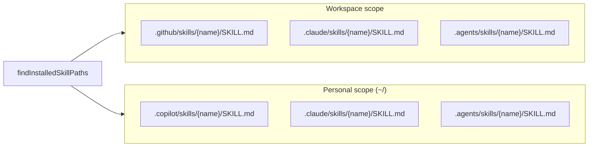

---

## 7. MCP Integration

### 7.1 Config detection order

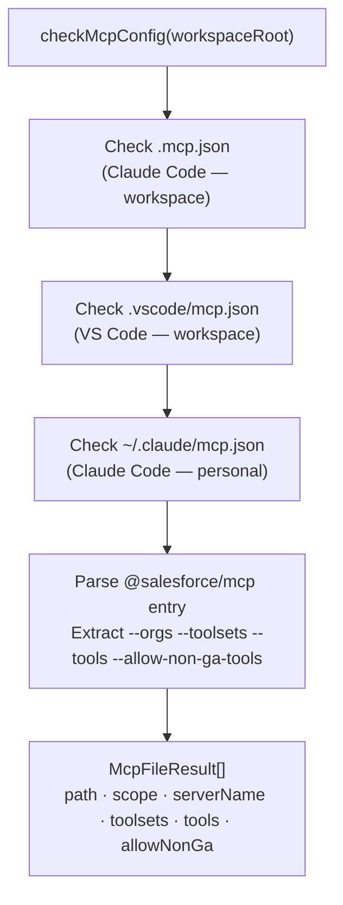

### 7.2 Installation flow

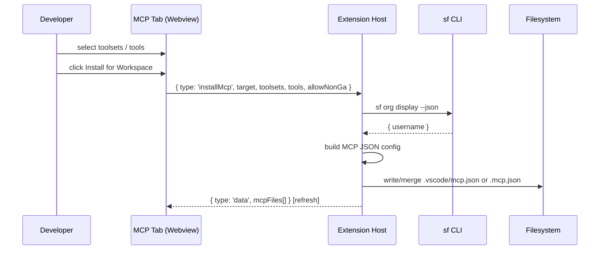

### 7.3 Toolsets catalogue

The extension documents 15 toolsets. Non-GA tools require `--allow-non-ga-tools`.

| Toolset | Always on | Non-GA tools |
|---|---|---|
| `core` | yes | — |
| `orgs` | | `create_scratch_org`, `delete_org`, `open_org`, `create_org_snapshot` |
| `deploy-retrieve` | | — |
| `apex` | | — |
| `data` | | — |
| `sobjects` | | — |
| `code-analysis` | | `create-custom-rule`, `generate_xpath_prompt` |
| `source-tracking` | | — |
| `documentation` | | — |
| `agent` | | — |
| `testing` | | — |
| `flow` | | — |
| `template` | | — |
| `lwc-experts` | | `explore_slds_blueprints`, `guide_slds_blueprints`, `guide_utam_generation`, `guide_slds_styling`, `explore_slds_styling`, `orchestrate_lwc_slds2_uplift` |
| `enrichment` | | `enrich_metadata` |

**Generated config — Claude Code (`.mcp.json`)**:

```json
{
  "mcpServers": {
    "Salesforce DX": {
      "command": "npx",
      "args": ["-y", "@salesforce/mcp",
               "--orgs", "devhub@example.com",
               "--toolsets", "core,apex,deploy-retrieve",
               "--allow-non-ga-tools"]
    }
  }
}
```

**Generated config — VS Code (`.vscode/mcp.json`)**:

```json
{
  "servers": {
    "Salesforce DX": {
      "type": "stdio",
      "command": "npx",
      "args": ["-y", "@salesforce/mcp",
               "--orgs", "devhub@example.com",
               "--toolsets", "core,apex,deploy-retrieve"]
    }
  }
}
```

---

## 8. Data Models

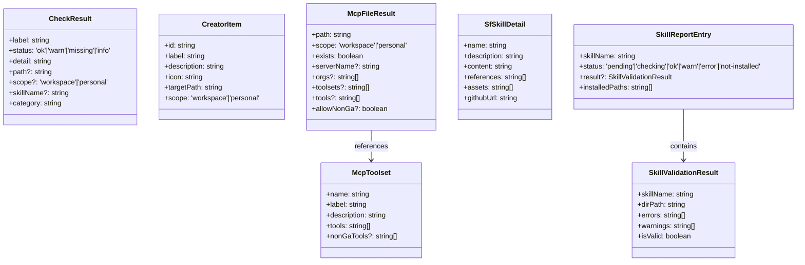

---

## 9. Build & Release Pipeline

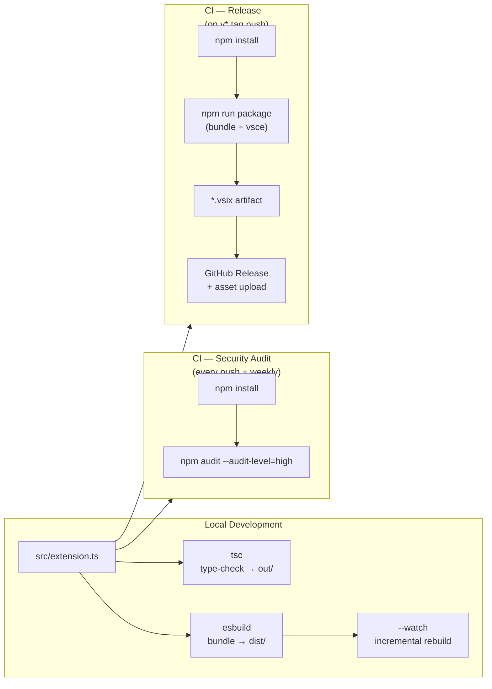

### Version bump procedure

```bash
npm version patch   # or minor / major
git push origin main --tags   # tag triggers the release workflow
```

`npm version` updates `package.json`, commits the change, and creates a local git tag in one step.

---

## 10. Security Model

### Content Security Policy

Every webview enforces a strict CSP using a per-request nonce generated by `getNonce()`:

```html
<meta http-equiv="Content-Security-Policy"
      content="default-src 'none';
               style-src 'unsafe-inline' ${webview.cspSource};
               script-src 'nonce-${nonce}';">
```

- `default-src 'none'` — denies all resources by default.
- Inline styles allowed (VS Code theme variables require it).
- Only `<script nonce="…">` blocks execute — no external scripts, no `eval`.

### Destructive operations

All file deletions require explicit user confirmation:

```
vscode.window.showWarningMessage(
  `Delete ${path}?`, { modal: true }, 'Delete'
)
```

### External network access

Only two outbound calls are made:

| From | To | Purpose |
|---|---|---|
| `SfSkillsPanel` | `api.github.com` | Fetch skills catalogue & content |
| `CopilotChecksViewProvider` | `sf` CLI (subprocess) | Detect default Salesforce org |

The `https` module is used directly (no fetch polyfill, no axios) — the extension stays dependency-free.

### Dependency security

Production bundle has **zero npm dependencies**. DevDependencies are pinned via `overrides` in `package.json` to ensure transitive vulnerabilities in `mocha`'s dependencies (`diff`, `serialize-javascript`) do not surface in `npm audit --audit-level=high`.

---

## 11. Skills in This Repository

This repository ships its own GitHub Copilot skills under `.github/skills/`. Skills follow the [agentskills.io](https://agentskills.io) specification and are validated automatically by the extension itself.

```
.github/
└── skills/
    └── <skill-name>/
        └── SKILL.md          # frontmatter + body (see spec below)
```

### SKILL.md structure (agentskills.io spec)

```markdown
---
name: "skill-name"
description: "Use this skill to … (20+ words, double-quoted)"
metadata:
  version: 1.0
---

## Body

Skill instructions here (max 500 lines recommended).
```

### Planned skills for this repository

| Skill name | Purpose |
|---|---|
| `audit-copilot-config` | Guide an AI agent to audit GitHub Copilot configuration files in a workspace |
| `configure-salesforce-mcp` | Step-by-step MCP server setup for Salesforce DX in VS Code and Claude Code |
| `validate-agent-skills` | Validate SKILL.md files against the agentskills.io specification |

Skills in this repository are available to any agent (GitHub Copilot, Claude Code) that resolves `.github/skills/` — no installation step required when the workspace is open.
